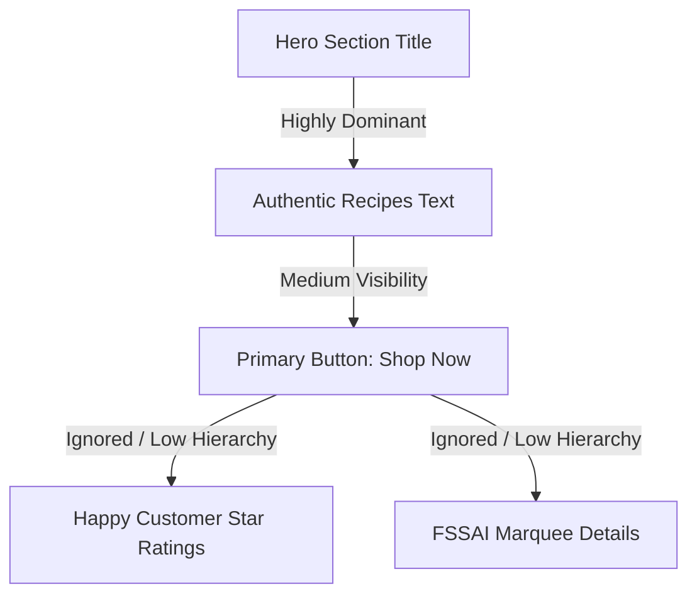

# Executive Summary

**Overall Conversion Readiness Score:** 6.5 / 10

Thiru Annamalai Natural Foods features an authentic and compelling traditional culinary narrative. However, the online purchasing funnel faces critical usability and visual barriers. Bridging the gap between a high-trust local brand and a modern global e-commerce experience is essential. While the product variety, Madurai heritage, and A2 Ghee ingredient quality are strong, several major issues prevent first-time, mobile, and international shoppers from completing checkouts successfully.

### Top 3 Critical Issues Blocking Purchases
1. **WhatsApp Checkout Redirection Confusion:** The primary checkout CTA redirects the user to WhatsApp without clear expectations. This creates friction for modern shoppers expecting a standard digital payment confirmation and damages conversion for non-domestic or low-attention users.
2. **Missing Real-Time Cart State in Navigation:** The navbar lacks a persistent dynamic cart badge or count indicator in several viewport states. Users cannot instantly verify if their "Add to Cart" action succeeded without manually opening the sidebar drawer.
3. **No Filtering/Searching in Catalog:** The product catalog has very basic filter categories ("All products", "Laddus", "Bars & Snacks"), but lacks search capability and essential filters (such as allergen exclusion, shelf-life, or dietary benefits like diabetic-friendly/sugar-free).

### Top 3 Trust Gaps
1. **FSSAI and Certification Visibility:** Although the home marquee lists "FSSAI Certified", the actual registration number, food safety certificates, and quality badges are absent from product pages and the checkout flow, introducing hesitation for health-conscious shoppers.
2. **Abstract/Inconsistent Product Imagery:** The product catalog relies heavily on stock-like images or varying visual styles. This lacks consistent brand lighting, staging, and packaging transparency, causing first-time buyers to question the handmade authenticity.
3. **Implicit Shipping and International Policies:** Shipping pricing is obscure. The home page mentions "Worldwide Delivery," but checkout has a hardcoded, unvalidated standard rate without calculating exact regional tariffs for overseas orders.

### Top 3 Mobile Friction Points
1. **Tappable Area and Overlapping Interactions:** The mobile product card buttons have thin touch targets (<40px) close to navigation elements, causing accidental clicks on images instead of CTAs.
2. **Complex Multi-Step Form Layout on Mobile viewports:** The billing and delivery form fields are stacked, taking up substantial vertical space. This requires extreme scrolling, which increases form abandonment rates.
3. **Lack of Dynamic Sticky Bottom CTA on Product Details:** When reading product features and descriptions on mobile, the primary "Add to Cart" button scrolls out of view, forcing users to scroll all the way back to the top to initiate a purchase.

---

# Major UX Problems

*   **Disruptive Checkout Redirection:** The checkout flow forces users onto WhatsApp. While excellent for local customers who prefer chat-based ordering, it completely alienates international or corporate clients expecting instant card transactions or digital wallet confirmations.
*   **Static Cart Persistence Awareness:** The drawer does not automatically open or trigger a micro-interaction when a product is added from the shop grid. Users receive a quick toast notification, but visual feedback is minimal, leaving them unsure of their current cart status.
*   **No Guest vs. Account Flow Separation:** There is no way for returning customers to save their delivery details. Every checkout attempt requires filling out name, phone, email, and long-form physical address fields manually, creating high interaction friction.
*   **Lack of Live Currency Integration Feedback:** While there is currency handling in the codebase, the currency selector does not instantly preview the global shipping surcharges or local tax adjustments, which leads to surprise friction at checkout.

---

# Major UI Problems

*   **Inconsistent Color Contrast on CTA Buttons:** The secondary buttons and text-based icons (e.g., Lucide Arrow links) do not maintain adequate contrast against soft background card tones (`#cream` and secondary backgrounds), failing to meet WCAG AA standards.
*   **Stretching and Image Aspect Ratios:** Product images stretch or crop poorly on ultra-wide screens or compact mobile devices. The aspect ratio is locked to square without responsive framing boundaries.
*   **Overlapping Decorative Waves:** The CSS variable wave graphics between sections (`WhyUs` cocoa waves) sometimes cut off text content or overlap adjacent interactive buttons on specific narrow viewports.
*   **Raw Input Borders & Inactive Focus States:** Form input fields on checkout have flat gray borders with no transition scaling or glow effects on focus, making the forms feel unpolished and untrustworthy.

---

# User Friction Points

*   **Lack of Weight & Quantity Selection in Grid:** Users must navigate to the product detail page just to choose a different pack size or configure quantity. They cannot quickly buy multiples directly from the homepage shop section.
*   **No Auto-fill or Address Validation:** The country, state, and city fields are raw text inputs instead of autocomplete drop-downs. This leads to high rates of manual spelling mistakes, leading to failed courier deliveries.
*   **Order Confirmation Blind Spot:** After completing checkout, the local storage-based order confirmation page displays "ORD-xxxxxxxx" but does not provide direct links to track shipments or contact delivery agents immediately.

---

# Visual Hierarchy Problems

*   **Hero Section Domination:** The large serif title in the hero area dwarfs the primary "Shop Now" call to action. First-time visitors' eyes are drawn to the aesthetic background graphics rather than the action points.
*   **Pricing vs. Add to Cart Button:** On the product card, the price font size is nearly twice the size of the "Add to Cart" label, but the button has a weak background contrast. This makes the price look like a non-interactive label rather than a purchase trigger.
*   **Story Page Block Paragraphs:** The brand narrative uses long, heavy blocks of text without bold highlights or visual sidebars, causing low-attention readers to skip the brand's core differentiators.

---

# Typography Problems

*   **Dual Font System Collision:** The display font (serif) has strong personality, but the body font is a standard, uncurated sans-serif that lacks structural spacing and proper line height (`leading-relaxed` is used inconsistently).
*   **Tamil and English Script Alignment:** The Tamil script in product taglines (e.g., "பாசிப்பருப்பு நெய் லட்டு") is smaller and has a different baseline than the English titles, making the product cards feel visually cluttered and unbalanced.
*   **Small Caption Sizes:** The packaging weights and shelf life are rendered at `text-xs` (12px or smaller), which is difficult to read for elderly consumers who represent a key demographic for traditional foods.

---

# Accessibility Problems

*   **Insufficient Text Contrast:** Elements using `text-muted-foreground` fail color contrast checks on light card backgrounds, scoring under 3.5:1.
*   **Missing ARIA Landmark Attributes:** The navigation bar, sections, and footer lack semantic labels like `aria-label="Primary Navigation"` or `role="banner"`, rendering the page difficult to navigate with screen readers.
*   **Keyboard Focus Trap in Cart Drawer:** When the cart drawer opens, keyboard focus is not trapped inside the drawer component, allowing keyboard users to tab to background page items invisibly.
*   **No Alt Text on Custom Graphical Wave SVGs:** The complex layout SVGs lack `aria-hidden="true"`, causing screen readers to read useless coordinate coordinates aloud to visually impaired users.

---

# Mobile Responsiveness Problems

*   **Horizontal Scroll Leaks:** On viewports under 360px (older mobile models), the global delivery grid leaks past the right side of the screen, creating horizontal layout shifts.
*   **Sticky Header Obstruction:** The sticky navigation header takes up too much vertical space on mobile devices in landscape mode, leaving very little room to read the actual product detail description.
*   **Unusable Form Inputs on Safari Mobile:** Text fields zoom in automatically on click because the font size is set under 16px, breaking page layout structure and forcing users to manually pinch-to-zoom out.

---

# Cognitive Load Analysis

*   **Decision Fatigue from High Similar Product Grid:** The shop displays all 10 millet and traditional laddus simultaneously in a dense grid, without highlighting unique selling points (e.g., "Best for Kids", "Diabetic Friendly", "Bone Health").
*   **Overloaded Hero Marquee:** The ticker marquee moves too fast, flashing FSSAI, A2 Ghee, and Shipping speed all at once, which distracts users from reading the primary value proposition text.
*   **Ambiguous WhatsApp Redirection State:** Because users are redirected to WhatsApp, they must hold a mental state of "What happens next? Am I talking to a bot? Will I get a link? How do I pay?" which creates high anxiety.

---

# Trust & Clarity Issues

*   **No Visible Founder Signature or Photo:** The story details "Thiru Annamalai Natural Foods" but lacks a real founder photo or video, making the business feel like a generic corporate entity rather than a premium, handmade local kitchen.
*   **Ambiguous Return & Refund Policy:** The footer link goes to a generic legal page instead of giving simple, reassuring copy on the product page (e.g., "100% Freshness Guarantee or Free Replacement").
*   **Unclear Domestic vs. Global Shipping Rules:** The homepage lists "USA & Canada: 7-12 days" but does not clarify customs clearances, import tariffs, or minimum package weights for overseas shipping.

---

# Recommended Priority Fixes

### Critical (Must Fix Before Launch)
1. **Redesign the WhatsApp Checkout Transition:** Add a prominent modal step *before* redirecting to WhatsApp. This modal should detail the exact 3-step checkout process (Send message -> Receive secure payment link -> Get tracking number).
2. **Implement Dynamic Header Cart Badge:** Add a vibrant, animated red/accent indicator displaying the item count over the cart icon in the navigation bar.
3. **Fix Form Font Zoom Issues:** Ensure all inputs, select selectors, and textareas have at least `text-base` (16px) font sizing on mobile viewports.

### High Priority (Significantly Impacts Conversion)
1. **Standardize Catalog Grid Layout:** Add high-quality, professional photography of the actual products (laddus and bars) with transparent packaging or wooden serving plates for a unified, clean brand look.
2. **Clarify Certifications:** Embed official FSSAI logos and organic certification badges directly under the "Add to Cart" button on all product detail pages.
3. **Add Fast Quantity Selectors to Grid Cards:** Allow users to add multiple boxes (1, 2, 5, 10) directly from the shop listing page without visiting the product details page.

### Medium Priority (Improves Experience)
1. **Improve Tamil Baseline Alignment:** Use proper font pairings for Tamil and English text to ensure identical line heights and clean, modern layout structure.
2. **Incorporate Interactive FAQ Accordions:** Group FAQs on the homepage into categories (Ingredients, Shipping, Custom Orders) to reduce visual noise.

### Low Priority (Polish & Enhancement)
1. **Refine Cocoa SVG Wave Transitions:** Smooth out the SVG shapes to prevent text block collisions.
2. **Implement Micro-Interactions on Wishlist Buttons:** Add a delicate pop animation when a product is saved to the wishlist.
