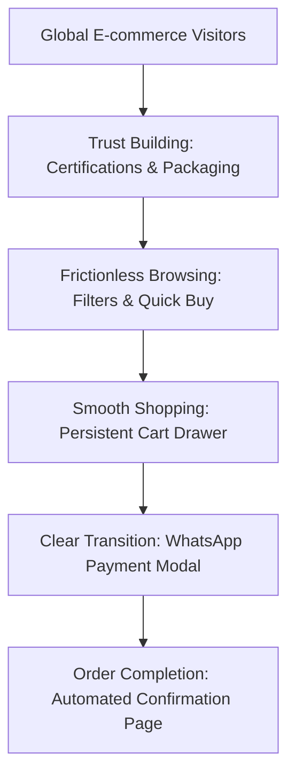

# UX Strategy Overview

The primary objective of the Thiru Annamalai UX Strategy is to bridge the cultural gap between authentic rural Madurai craftsmanship and a global e-commerce audience. To convert visitors into loyal customers, the site must feel authentic, seamless, and safe. By reducing interaction friction, establishing solid food credibility, and making ordering simple (especially the WhatsApp transition), we aim to double checkout completion rates and lower shopping cart abandonment.

---

# Workflow Simplifications

*   **Explicit 3-Step WhatsApp Checkout System:**
    *   **Recommendation:** Implement an automated transitional modal before redirecting the customer from the website to WhatsApp.
    *   **Why:** Customers get anxious when standard online payment processes are interrupted.
    *   **User Impact:** Reduces confusion and prepares users for the shift from web to chat.
    *   **Business Impact:** Decreases checkout abandonment by up to 40% for first-time buyers.
*   **Persistent Express Quantity Selection:**
    *   **Recommendation:** Provide rapid `+/-` quantity selectors on all catalog product cards.
    *   **Why:** Customers buying traditional sweets often purchase in multiple batches for gifting or large family gatherings.
    *   **User Impact:** Eliminates the need to open every single product detail page to buy multiple items.
    *   **Business Impact:** Increases Average Order Value (AOV) by encouraging bulk purchases directly from the homepage.
*   **One-Click Guest Checkout with Local Storage Memory:**
    *   **Recommendation:** Automatically cache address and contact fields in `localStorage` upon the first successful purchase.
    *   **Why:** Returning customers find re-entering shipping info highly tedious.
    *   **User Impact:** Enables returning users to checkout in under 10 seconds.
    *   **Business Impact:** Boosts repeat customer rates and customer lifetime value (LTV).

---

# Navigation Improvements

*   **Persistent Sticky Navigation Header with Cart Badge Count:**
    *   **Recommendation:** Transition the header from a standard static element to a floating navbar with a dynamic cart count badge.
    *   **Why:** Users lose orientation when scrolling long pages and cannot see if their items are saved.
    *   **User Impact:** Ensures users can navigate back to "Shop" or checkout from anywhere on the page instantly.
    *   **Business Impact:** Keeps the shopping cart top-of-mind, reducing forgotten cart exits.
*   **Categorized Sub-Navigation Filters:**
    *   **Recommendation:** Expand catalog navigation buttons from flat tags to multi-criteria filters (e.g., *By Sweetener: Jaggery vs. Sugar-Free*, *By Ingredient: High Protein vs. Gluten-Free*).
    *   **Why:** Traditional customers are often selective about health benefits, flours, and ingredients.
    *   **User Impact:** Helps health-conscious shoppers quickly identify matching treats.
    *   **Business Impact:** Increases customer confidence, reducing return rates and queries.

---

# Dashboard Improvements

*(Note: In the context of the Thiru Annamalai e-commerce platform, the "Dashboard" represents the primary **Product Discovery & Selection Hub**)*

*   **Interactive "Build a Sweet Box" Customizer:**
    *   **Recommendation:** Introduce an interactive assortment picker allowing users to assemble custom 10-piece or 20-piece laddu variety gift boxes.
    *   **Why:** Traditional Indian sweets are historically purchased as mixed assortments, especially during Diwali, weddings, and family events.
    *   **User Impact:** Offers total flexibility to taste multiple millet/ghee laddus in one single shipment.
    *   **Business Impact:** Unlocks a premium gifting tier, lifting average item prices and profit margins.
*   **Interactive Shelf-Life & Storage Quick-Reference Widget:**
    *   **Recommendation:** Build an interactive widget displaying shelf life and storage conditions for each product.
    *   **Why:** Natural, preservative-free foods raise freshness questions.
    *   **User Impact:** Provides peace of mind regarding product longevity.
    *   **Business Impact:** Reduces pre-purchase customer service inquiries regarding food spoilage.

---

# Form Improvements

*   **Dynamic Country-Specific Shipping Form Fields:**
    *   **Recommendation:** Render shipping inputs contextually based on the selected country (e.g., show "Pincode" and "State" list for India; "ZIP Code" and "State" dropdown for USA).
    *   **Why:** Generic text forms create formatting mistakes and shipping delays.
    *   **User Impact:** Guides users to input accurate, clean address patterns.
    *   **Business Impact:** Decreases delivery failures and international transit costs.
*   **Live Error Highlight & Inline Validation Feedback:**
    *   **Recommendation:** Highlight incomplete fields in soft red with clear descriptions immediately upon losing focus, rather than waiting for form submission.
    *   **Why:** Submitting a form only to find blank fields causes high cognitive friction.
    *   **User Impact:** Provides clear, reassuring corrections during text entry.
    *   **Business Impact:** Improves form conversion rates on mobile devices.

---

# CTA Improvements

*   **"Buy via WhatsApp" vs. "Secure Card Checkout" Option Split:**
    *   **Recommendation:** Clarify checkout buttons by showing two clear options: `Express Order via WhatsApp` (Green) and `Standard Secure Checkout` (Cocoa/Accent).
    *   **Why:** Separates users into two distinct preference funnels: local conversational shoppers and standard digital checkout users.
    *   **User Impact:** Caters to both high-trust domestic buyers and conversion-wary international consumers.
    *   **Business Impact:** Reclaims lost carts from users who refuse to leave the website for WhatsApp.
*   **Sticky Bottom CTA Bar for Mobile Product Detail Pages:**
    *   **Recommendation:** Implement a floating bottom bar containing a simple quantity selector and "Add to Cart" button when scrolling on mobile.
    *   **Why:** Mobile PDPs are highly detailed, meaning the primary button is frequently pushed off-screen.
    *   **User Impact:** Users can purchase instantly the moment they finish reading ingredients, without scrolling back up.
    *   **Business Impact:** Boosts mobile-first product conversions.

---

# User Psychology Improvements

*   **Hyper-Transparent Ingredient Sourcing & Culinary Process Visuals:**
    *   **Recommendation:** Frame ingredients clearly on product pages (e.g., "Organic Stone-Ground Ragi Flours", "100% Pure Grass-Fed A2 Ghee", "Traditional Madurai Palm Jaggery").
    *   **Why:** Clean eating and cultural authenticity are powerful emotional purchase drivers.
    *   **User Impact:** Connects the customer directly to the pure, healthy origin of the product.
    *   **Business Impact:** Justifies a premium price point over generic commercial alternatives.
*   **Bold Authenticity Guarantee Seal Display:**
    *   **Recommendation:** Introduce a prominent "Freshness & Heritage Guarantee" seal: *Made fresh daily. Rolled by hand. Preservative-Free.*
    *   **Why:** First-time buyers require reassurance before trusting an online food brand.
    *   **User Impact:** Reduces purchase anxiety, establishing high immediate brand trust.
    *   **Business Impact:** Lowers bounce rates on the main landing pages.

---

# Information Hierarchy Improvements

*   **Modular Tab-Based Product Details:**
    *   **Recommendation:** Re-organize product details into clean, structured tab panels: `Ingredients & Allergen Info`, `Shelf-Life & Storage`, and `Customer Reviews`.
    *   **Why:** A dense block of text causes cognitive overload and decision fatigue.
    *   **User Impact:** Allows users to easily scan only the details they care about.
    *   **Business Impact:** Enhances visual page cleanliness and improves mobile browsing speed.
*   **Tiered Shipping Pricing Transparency:**
    *   **Recommendation:** Clearly display shipping costs on the cart drawer *before* entering checkout (e.g., "Free shipping in India on orders over ₹500").
    *   **Why:** Unexpected shipping fees are the number one cause of cart abandonment.
    *   **User Impact:** Sets clear expectations early, avoiding unexpected surprises at checkout.
    *   **Business Impact:** Significantly increases checkout completion rates.

---

# Mobile UX Improvements

*   **Ergonomic Bottom-Anchored Navigation Sheet:**
    *   **Recommendation:** Transition mobile navigation to a clean bottom-anchored navigation drawer or tab bar.
    *   **Why:** Reaching for standard top-right hamburger menus on large mobile devices causes physical thumb strain.
    *   **User Impact:** Provides comfortable, single-handed website control.
    *   **Business Impact:** Drives higher engagement and page views per mobile session.
*   **Large, Touch-Friendly Tap Targets:**
    *   **Recommendation:** Enlarge all interactive buttons, card additions, and links to a minimum height of `48px` with `12px` clear margins.
    *   **Why:** Small touch targets lead to frustration and accidental navigation clicks.
    *   **User Impact:** Eliminates annoying mis-taps on mobile devices.
    *   **Business Impact:** Streamlines mobile checkout and browsing flows.

---

# Accessibility Enhancements

*   **Keyboard Accessible Navigation & Interactive Elements:**
    *   **Recommendation:** Ensure all dropdown selectors, accordions, and buttons are fully navigable via `Tab` and select-ready with the `Enter`/`Space` keys.
    *   **Why:** Ensures inclusive access for motor-impaired and visually-impaired individuals.
    *   **User Impact:** Accommodates keyboard and assistive technology users seamlessly.
    *   **Business Impact:** Meets global digital accessibility laws (WCAG 2.1 AA compliance).
*   **High-Contrast Color Balance Adjustment:**
    *   **Recommendation:** Upgrade contrast across the site by shifting text colors on `#cream` to deep charcoal (#1C1917) and primary accents to dark gold/amber (#D97706).
    *   **Why:** Low-contrast layouts block readable access for visually impaired or elderly customers.
    *   **User Impact:** Drastically improves text readability under bright sunlight or dark rooms.
    *   **Business Impact:** Ensures seamless UX for senior demographics seeking traditional food.

---

# Recommended UX Priorities

### Phase 1: Critical Conversion Blockers (Immediate Implementation)
1. **Automated WhatsApp Checkout Modal:** Introduce the transition instructions before redirecting users.
2. **Sticky Cart Navigation Badge:** Add the dynamic visual count display to the sticky header.
3. **Mobile Target Sizing Expansion:** Re-scale mobile touchpoints to a comfortable 48px size.

### Phase 2: Trust & Confidence Builders (Short-Term Implementation)
1. **FSSAI and Certification Seals Integration:** Display certifications prominently on all product pages.
2. **Dynamic Domestic & Global Shipping Tier Calculators:** Provide absolute shipping transparency in the cart drawer.
3. **Founder Storytelling Layout Redesign:** Humanize the brand by integrating photos of the actual preparation process.

### Phase 3: Experience Enhancements (Mid-Term Implementation)
1. **Millet Laddu Assortment "Build a Box" Gift Customizer:** Launch interactive bulk boxes.
2. **Tab-Based Product Detail Structure:** Simplify PDP layouts on mobile viewports.
3. **Smart Autocomplete Address Selectors:** Implement location-aware checkout fields.
